# Forge & Flight — System Diagrams

> All diagrams use Mermaid syntax and render in GitHub, VS Code, and any Mermaid-compatible viewer.

---

## Table of Contents

1. Use Case Diagram
2. Entity-Relationship (ER) Diagram
3. System Architecture Diagram
4. Component Diagram (Frontend)
5. Data Flow Diagram — App Startup
6. Sequence Diagram — Login
7. Sequence Diagram — Post a Comment
8. Sequence Diagram — Apply to Collaboration Role
9. Sequence Diagram — Invest in a Startup
10. Activity Diagram — User Registration
11. Activity Diagram — Create a Startup
12. State Machine — Application Lifecycle
13. State Machine — Investment Lifecycle
14. State Machine — Startup Funding Status
15. Deployment Diagram
16. Class Diagram (Backend Models)

---

## 1. Use Case Diagram

```mermaid
graph TD
    Guest(["Guest (not logged in)"])
    User(["User (logged in)"])
    Owner(["Startup Owner"])

    Guest --> UC1["Browse startup feed"]
    Guest --> UC2["View startup profile"]
    Guest --> UC3["View posts"]
    Guest --> UC4["Register / Sign up"]
    Guest --> UC5["Log in"]

    User --> UC1
    User --> UC2
    User --> UC3
    User --> UC6["Save a startup"]
    User --> UC7["Follow a startup"]
    User --> UC8["Post a comment"]
    User --> UC9["Apply to collaboration role"]
    User --> UC10["Invest in a startup"]
    User --> UC11["Create a startup"]
    User --> UC12["Post a feed update"]
    User --> UC13["View messages"]
    User --> UC14["View notifications"]
    User --> UC15["Edit own profile"]
    User --> UC16["Log out"]
    User --> UC17["Explore / search startups"]

    Owner --> UC6
    Owner --> UC7
    Owner --> UC8
    Owner --> UC12
    Owner --> UC18["Edit startup details"]
    Owner --> UC19["Review collaboration applications"]
    Owner --> UC20["Accept or decline an application"]
    Owner --> UC21["Review investment requests"]
    Owner --> UC22["Accept or reject an investment"]
    Owner --> UC23["Manage team members"]
    Owner --> UC24["Manage timeline events"]
    Owner --> UC25["Manage startup documents"]
    Owner --> UC26["View founder dashboard"]

    style Guest fill:#e8f4fd,stroke:#2196F3
    style User fill:#e8f5e9,stroke:#4CAF50
    style Owner fill:#fff3e0,stroke:#FF9800
```

---

## 2. Entity-Relationship (ER) Diagram

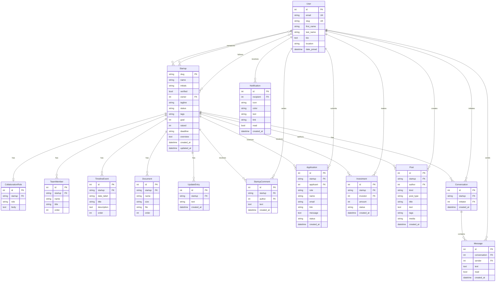

---

## 3. System Architecture Diagram

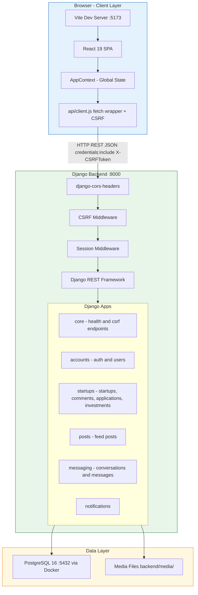

---

## 4. Component Diagram (Frontend)

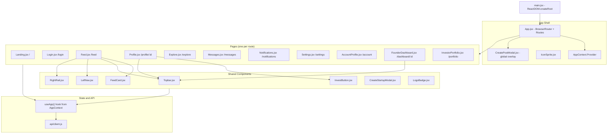

---

## 5. Data Flow Diagram — App Startup

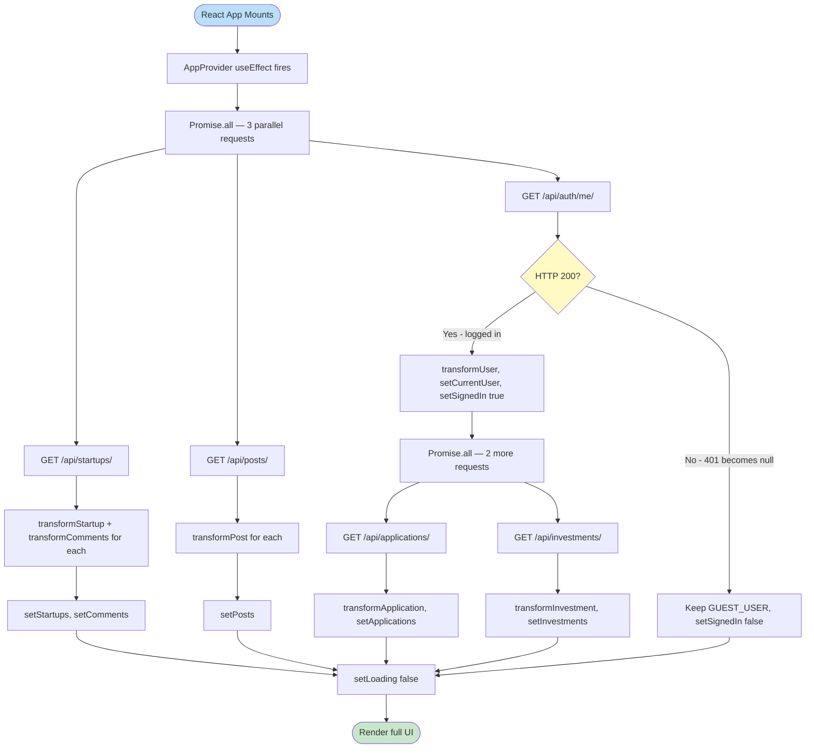

---

## 6. Sequence Diagram — Login

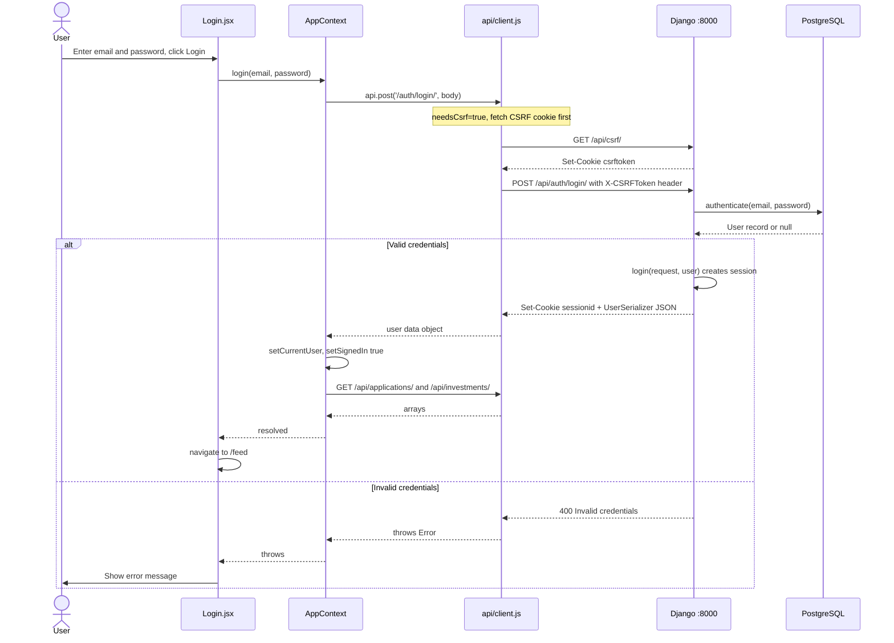

---

## 7. Sequence Diagram — Post a Comment

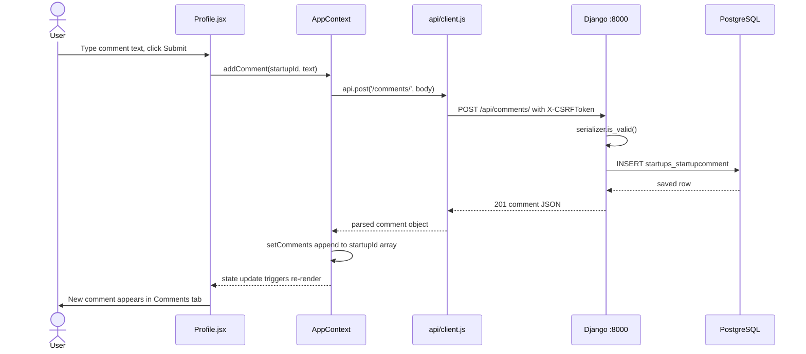

---

## 8. Sequence Diagram — Apply to Collaboration Role

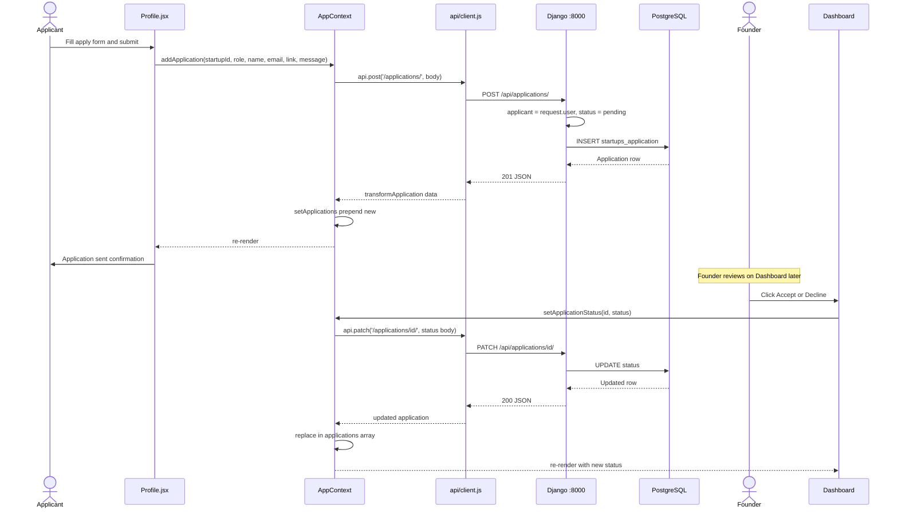

---

## 9. Sequence Diagram — Invest in a Startup

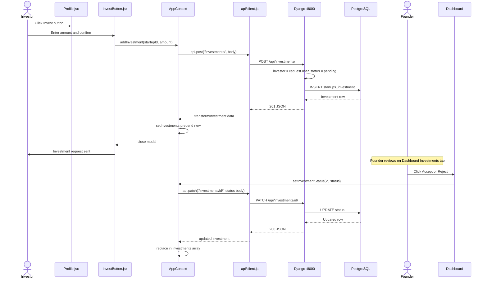

---

## 10. Activity Diagram — User Registration

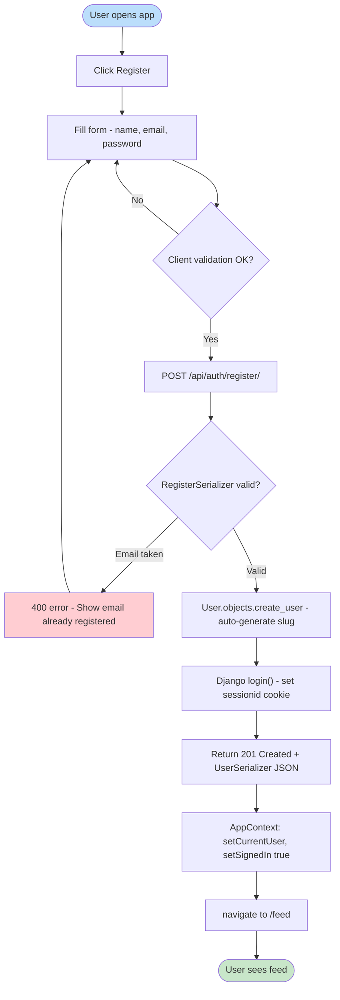

---

## 11. Activity Diagram — Create a Startup

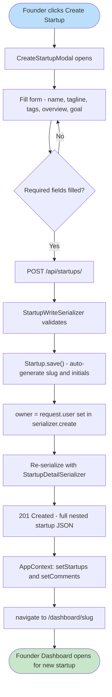

---

## 12. State Machine — Application Lifecycle

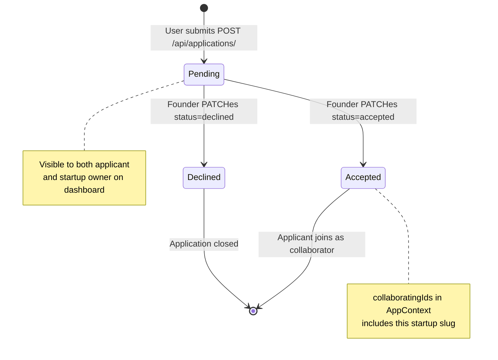

---

## 13. State Machine — Investment Lifecycle

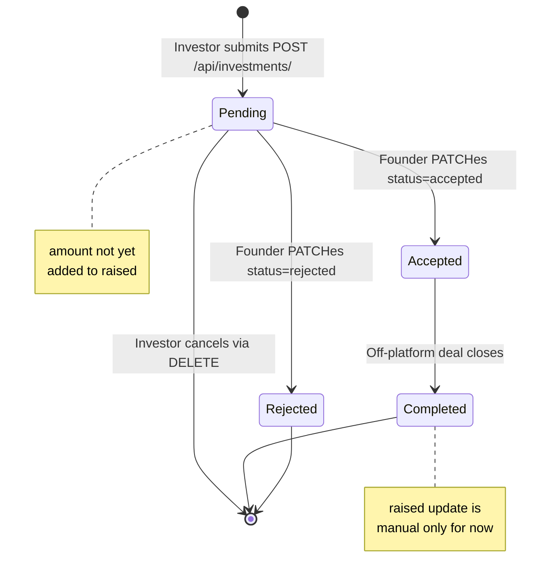

---

## 14. State Machine — Startup Funding Status

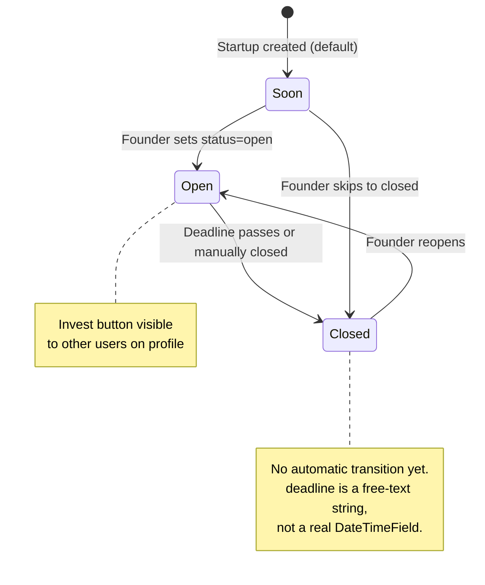

---

## 15. Deployment Diagram

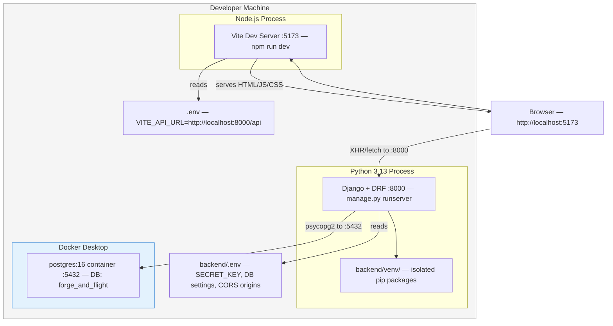

---

## 16. Class Diagram (Backend Models)

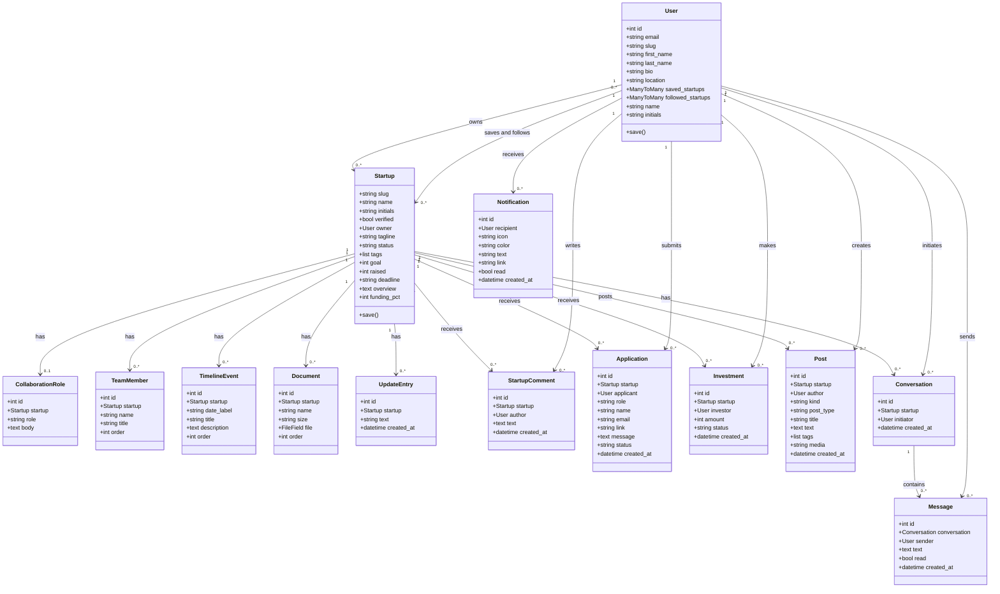

---

*Generated from source analysis of backend models, views, serializers, URLs and src React components and context.*
